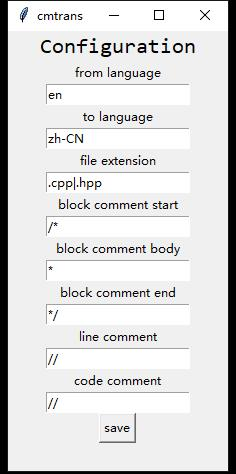
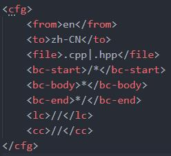
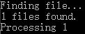

# CmTrans
## 代码注释翻译工具
**cmtrans能够自动将输入的文件中的注释部分翻译而不会影响代码。**  

[TOC]

------
## 运行方法
|平台|运行方法|
|:-----:|:------|
|Windows 7+|Windows系统下，py文件可以直接运行，或用pyinstaller打包后运行。|
|Linux / OsX|命令行运行，或用pyinstaller打包后运行，注意不要添加-w参数。|

Linux / OsX（运行、打包）：  
``` bash
~$ python3 cmtrans.py
~$ python3 -m pyinstaller -F cmtrans.py
```
Windows（打包）：  
``` bat
> python -m pyinstaller -F cmtrans.py
```
------
## 使用说明
1. 应用配置文件 trans-cfg.xml 必须和程序放在同一目录下。  
2. 直接运行或命令行不加参数运行时，打开“修改配置”窗口。  
3. 命令行添加一个或多个文件参数运行时，按配置翻译这些文件和子目录的文件（仅一层）。  
块注释有大量文字的翻译后自动换行  
5. 不要运行太频繁。每小时处理10个文件是最高效率，否则会网络失败。  

### 配置文件
>它的文件名后缀是XML，我可没说它是XML。
>程序只寻找两个标签之间的内容而并不解析XML，所以不要换行。
>你也可以把根元素去掉或者在标签之外打一些字，这不影响本程序。
>如果文件是空的，只需不加参数直接运行程序，点save键自动部署格式。
>没有这个文件呢？新建一个文件命名为`trans-cfg.xml`。
>其实没必要自己去修改配置文件，直接运行打开窗口，这会方便很多。

 

|名称|说明|
|:-:|:-|
|from|`翻译自`语言，留空或`auto`为自动检测。|
|to|`翻译为`语言，不得留空，否则网络失败。|
|file|要翻译的文件后缀名，有多个用`|`隔开，不要空格，程序只会翻译这些后缀的文件。|
|bc-start|`块注释`的开始标记。如`python`的首尾标记相同的块注释暂不支持。|
|bc-body|`块注释`的中间行首标记。如`python`的中间部分没有标记的块注释暂不支持。|
|bc-end|`块注释`的结束标记，必须位于一行的行首。|
|lc|`行注释`的行首标记。|
|cc|`代码注释`的分界标记，取最后一个标记右边部分为注释。|

### 如何使用
把要翻译的文件拖到cmtrans.py(cmtrans.exe etc.)，自动完成。


## 下载
版本库：[link](https://github.com/DarthJesusYan/-cmtrans)
|下载|链接|
|-|-|
|`trans-cfg.xml`|[link](./trans-cfg.xml)|
|`Python3`源代码|[link](./cmtrans.py)|
|`Windows` `x86/64`|[link](./cmtrans.exe)|
|`Linux` `x64`|[link](./cmtrans)|